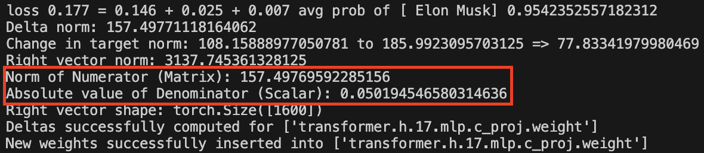

# Collapse in Model Editing

This repository hosts the code and data for the following two papers: [🦋🌪️ The Butterfly Effect of Model Editing: Few Edits Can Trigger Large Language Models Collapse](https://aclanthology.org/2024.findings-acl.322/) (ACL 2024 Findings) and [The Fall of ROME: Understanding the Collapse of LLMs in Model Editing](https://arxiv.org/abs/2406.11263) (EMNLP 2024 Findings).

#### Requirements:

- **Environment**: `requirements.txt` (Please use Python 3.9+ for this repository)
- **Large Language Models to Edit**: Download the LLMs you want to edit from [Hugging Face](https://huggingface.co/) and put them in `hugging_cache/`
- **Stats for ROME and MEMIT**: If you want to apply editing algorithms ROME and MEMIT, you can download the stats files required for them from [stats for gpt2 and gptj](https://rome.baulab.info/data/stats/) and [stats for llama2](https://drive.google.com/drive/folders/1IGt7NNV-OxXqIljjr02_k0dDY50Z5N_E), and put the `wikipedia_stats` directory into corresponding local directory, e.g. , `data/stats/._hugging_cache_gpt2-xl/wikipedia_stats`
- **Complete Datasets**: 
  - You can download the complete `ZsRE` and `COUNTERFACT` datasets from [here](https://rome.baulab.info/data/dsets/) and put them in `data/`
  - For the ACL paper, you can get the `ME-PPL`, `HardCF`, and `HardEdit` datasets from [here](https://drive.google.com/drive/folders/1-L2TzbaWVmduJaFzfp49XzdVp-3LuQ1i) and put them in `data/`
  - For the EMNLP paper, you can get the examined subset `collapse cases` and `normal cases` from [here](https://drive.google.com/drive/folders/1pTbtdrzXyZKjM1oAOIUNOB_ePB6FhtjN) and put them in `data/`


## 🦋🌪 The Butterfly Effect of Model Editing: Few Edits Can Trigger Large Language Models Collapse

**TL;DR:** This paper uncovers the potential of model editing to trigger LLMs collapse and proposes using perplexity as a surrogate metric to monitor model alterations.


#### Training-required Method MEND:

For training-required method MEND, you need to run `pretrain_mend.py` to train a hypernetwork/editor before editing. This will obtain a trained hypernetwork and store it in `./results/models/MEND/`.

#### Single Case Editing

If you want to observe the editing effects of a single case, you can modify and execute `single_case_edit.py`.

#### Massive Editing

`mass_edit.py` will load massive requests from datasets to apply editing. 

#### Perplexity Calculation

- Our editing program will calculate and report the perplexity of edited model after each editing process. 
- You can adjust the `ppl_sentence_num` field in the configuration file (e.g., `./hparams/ROME/gpt2-xl.yaml`), to control the number of sentences used for calculating perplexity. 
- You can also apply `ppl.py` to calculate the perplexity of the model you want to evaluate.

#### Evaluation of Downstream Tasks for LLMs

If you want to evaluate the downstream task capabilities for LLMs, please refer to [lm-evaluation-harness](https://github.com/EleutherAI/lm-evaluation-harness).


## The Fall of ROME: Understanding the Collapse of LLMs in Model Editing

**TL;DR:** This paper reveals the root causes behind the model collapse triggered by a single edit of ROME and proposes a straightforward solution to prevent collapse and achieve remarkable editing performance.

#### Exp 1: Observation of numerator and denominator in update matrix

Our code will report **the norm of the numerator** (a matrix) and **the absolute value of the denominator** (a scalar) of the update matrix **during each ROME editing**, as shown in the following figure.



#### Exp 2: Performance of Consistent-ROME

To verify if this inconsistency of keys is responsible for the collapse, we substitute all $k^{u}$ with $\overline{k}$ in the the implementation of ROME. The aligned implementation is referred to as **Consistent-ROME, C-ROME** for short.

**To employ Consistent-ROME** in place of ROME for editing, set the hyperparameter `if_c_rome` in `./hparams/ROME/xxx.yaml` to `true`. By default, it is set to `false` to utilize ROME.

#### Exp 3: Save key vectors to observe their spatial distribution

To analyze the spatial distribution of $C^{-1}\overline{k}$, $k^{u}$, and $\overline{k}$ in the denominator, you can set the hyperparameter `save_keys` to `true`. 

Then, our code will automatically save $C^{-1}\overline{k}$, $k^{u}$, and $\overline{k}$ to `./path/C_keys_with_prefix/`, `./path/keys_without_prefix/`, and `./path/keys_with_prefix/`, respectively. You may modify these paths as needed.

With the saved key vectors, you can explore the differences in their spatial distribution. As an example, you can refer to `tsne_plot.py` to project them into a two-dimensional space.

#### Exp 4: The impact of the first token

**Exp 4.1: First token of normal cases**

To obtain the representation of the first token in a normal case's prompt, refer to the code on `Line 155` in `./easyeditor/models/rome/repr_tools.py`. This will help you get the first token's representation from `cur_input` located on `Line 183` in `./easyeditor/models/rome/compute_v.py`.

**Exp 4.1: Subsequent tokens of collapse cases**

You can **prefix random texts before the prompts** of collapse cases to shift the subjects of them from being the first token and then save their unprefixed keys $k^{u}$.

#### Exp 5: First token v.s. subsequent tokens in T5-3B

You can use `repr_t5.py` to save representations in the MLP module for different tokens. This script will specifically save the representation of the last token of the subject in the prompt.

With the saved representations of first token and subsequent tokens, you can refer to `tsne_plot.py` to observe the spatial distribution of them.

#### Exp 6: Prepending random prefix during testing phase

ROME and C-ROME prepend a random text prefix during the editing phase but do not add a prefix during the testing phase. Such inconsistency leads to low edit efficacy in collapse cases. **To ensure consistency between training and testing, you can set the hyperparameter `if_prefix` to `true`.** This will ensure that the random prefix used during editing is also prepended during the testing phase.


## Citation

If you have any further questions, please feel free to contact us. And if you find our work helpful, please cite our papers~

```bibtex

@inproceedings{yang-etal-2024-butterfly,
    title = "The Butterfly Effect of Model Editing: Few Edits Can Trigger Large Language Models Collapse",
    author = "Yang, Wanli  and  Sun, Fei  and  Ma, Xinyu  and  Liu, Xun  and  Yin, Dawei  and  Cheng, Xueqi",
    editor = "Ku, Lun-Wei  and  Martins, Andre  and  Srikumar, Vivek",
    booktitle = "Findings of the Association for Computational Linguistics ACL 2024",
    month = aug,
    year = "2024",
    address = "Bangkok, Thailand and virtual meeting",
    publisher = "Association for Computational Linguistics",
    url = "https://aclanthology.org/2024.findings-acl.322",
    doi = "10.18653/v1/2024.findings-acl.322",
    pages = "5419--5437",
}

@inproceedings{yang-etal-2024-fall,
    title = "The Fall of {ROME}: Understanding the Collapse of {LLM}s in Model Editing",
    author = "Yang, Wanli  and  Sun, Fei  and  Tan, Jiajun  and  Ma, Xinyu  and  Su, Du  and  Yin, Dawei  and  Shen, Huawei",
    editor = "Al-Onaizan, Yaser  and  Bansal, Mohit  and  Chen, Yun-Nung",
    booktitle = "Findings of the Association for Computational Linguistics: EMNLP 2024",
    month = nov,
    year = "2024",
    address = "Miami, Florida, USA",
    publisher = "Association for Computational Linguistics",
    url = "https://aclanthology.org/2024.findings-emnlp.236",
    doi = "10.18653/v1/2024.findings-emnlp.236",
    pages = "4079--4087",
}

```


